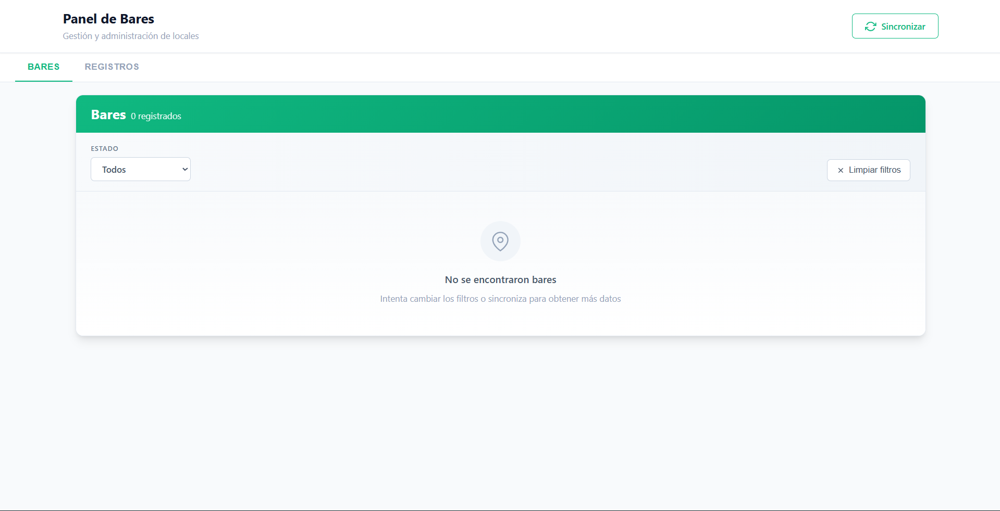
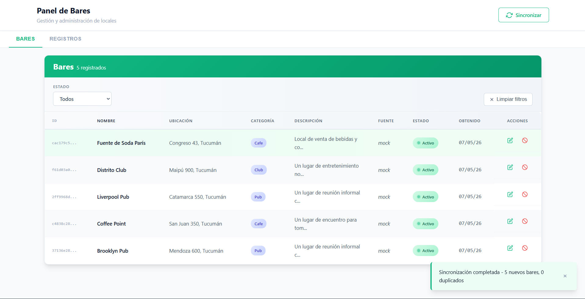
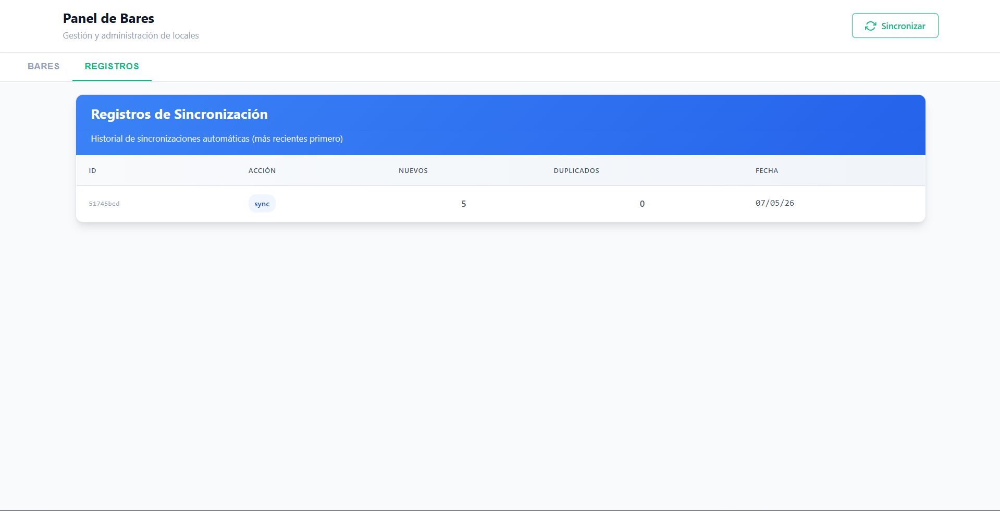
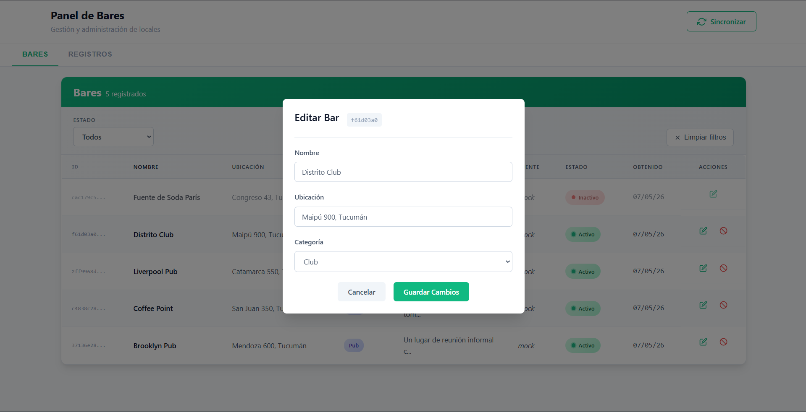
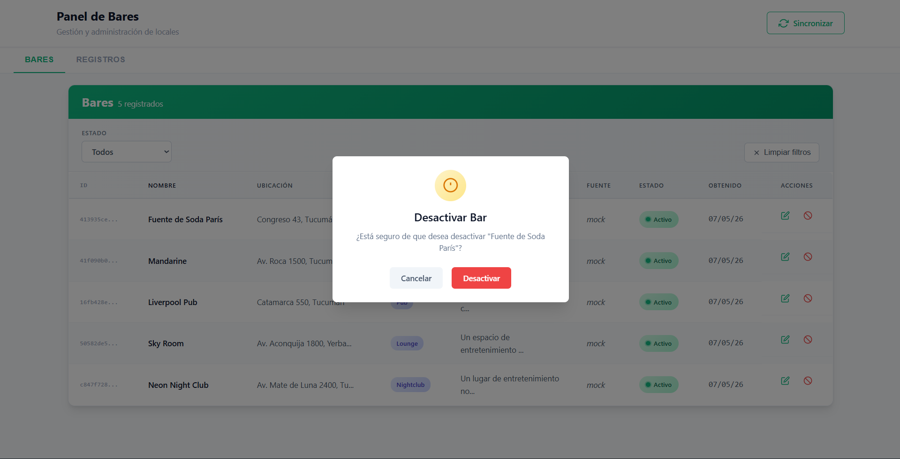
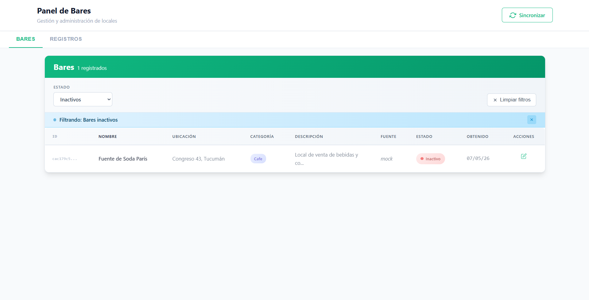

# Sistema de Gestión de Bares

Sistema automatizado para obtener, procesar y administrar bares de la provincia de Tucumán, Argentina.

---

## ¿De qué trata el sistema?

Este sistema permite gestionar bares de Tucumán de forma automatizada. El sistema obtiene datos desde una fuente mock, los procesa con Inteligencia Artificial para clasificarlos y detectar duplicados, y los expone mediante una API REST consumida por un dashboard web.

**Funcionalidades principales:**
- Gestión completa (CRUD) de bares
- Sincronización automática de datos mediante un scheduler
- Clasificación automática por categoría usando IA (bar, boliche, café, restaurante, etc.)
- Detección de duplicados semánticos aunque los nombres sean distintos ("Bar Irlanda" = "Irlanda Bar")
- Dashboard web para visualizar, editar y administrar los bares
- Historial de sincronizaciones con logs detallados

---

## Stack Tecnológico

### Backend
| Tecnología | Uso |
|---|---|
| NestJS + TypeScript | Framework principal |
| Prisma ORM | Acceso a base de datos |
| PostgreSQL (Supabase) | Base de datos relacional |
| Groq API | Clasificación y detección de duplicados con IA |
| @nestjs/schedule | Automatización con cron jobs |
| class-validator | Validación de DTOs |
| class-transformer | Transformación de datos de DTOs |
| Docker | Contenedorización |

### Frontend
| Tecnología | Uso |
|---|---|
| React + TypeScript | UI del dashboard |
| Vite | Build tool |

### DevOps & CI/CD
| Tecnología | Uso |
|---|---|
| GitHub Actions | Integración continua y automatización |
| Docker | Contenedorización y despliegue |
| Docker Compose | Orquestación local de contenedores |

**Pipeline de CI:**
- **Trigger**: Push a `main` o Pull Request a `main` o Manual
- **Pasos**:
  1. Checkout del repositorio
  2. Setup Node.js v20.17.0
  3. Instalación de dependencias (`npm ci`)
  4. Ejecución de tests (`npm run test`)
  5. Build del proyecto (`npm run build`)

El pipeline asegura que todo nuevo código tenga tests pasando y se compile correctamente antes de ser mergeado.

---

## Estructura del Proyecto

### Backend (`backend/`)

```
backend/
├── src/
│   ├── ai/                          # Módulo de IA (Groq)
│   │   ├── ai.module.ts
│   │   └── ai.service.ts            # Clasificación y detección de duplicados
│   ├── common/
│   │   ├── filters/
│   │   │   └── exceptions.filter.ts # Exception filter global
│   │   └── interceptors/
│   │       └── response.interceptor.ts  # Response interceptor global
│   ├── database/
│   │   ├── database.module.ts
│   │   └── database.service.ts      # Servicio de Prisma
│   ├── logs/
│   │   ├── dto/
│   │   │   └── response-logs.dto.ts
│   │   ├── interfaces/
│   │   │   ├── logs.repository.interface.ts
│   │   │   └── logs.service.interface.ts
│   │   ├── logs.constants.ts
│   │   ├── logs.controller.ts
│   │   ├── logs.module.ts
│   │   ├── logs.repository.ts
│   │   └── logs.service.ts
│   ├── sync/
│   │   ├── data/
│   │   │   └── venues.mock.ts       # Mock de bares tucumanos
│   │   ├── interfaces/
│   │   │   └── sync.service.interface.ts
│   │   ├── sync.constants.ts
│   │   ├── sync.controller.ts
│   │   ├── sync.module.ts
│   │   └── sync.service.ts          # Lógica de sincronización + cron job
│   ├── venues/
│   │   ├── dto/
│   │   │   ├── create-venues.dto.ts
│   │   │   ├── get-venues.dto.ts
│   │   │   ├── query-vanues.dto.ts
│   │   │   ├── response-venues.dto.ts
│   │   │   └── update-venues.dto.ts
│   │   ├── interfaces/
│   │   │   ├── venues.repository.interface.ts
│   │   │   └── venues.service.interface.ts
│   │   ├── mappers/
│   │   │   └── venue.mapper.ts
│   │   ├── venues.constants.ts
│   │   ├── venues.controller.ts
│   │   ├── venues.module.ts
│   │   ├── venues.repository.ts
│   │   └── venues.service.ts
│   ├── app.module.ts
│   └── main.ts
├── prisma/
│   ├── schema.prisma
│   └── migrations/
├── test/
│   ├── app.e2e-spec.ts
│   └── jest-e2e.json
├── docker-compose.yml
├── Dockerfile
├── nest-cli.json
├── package.json
└── tsconfig.json
```

### Frontend (`front/`)

```
front/
├── src/
│   ├── components/
│   │   ├── Dashboard/
│   │   │   ├── Dashboard.tsx
│   │   │   └── Dashboard.css
│   │   ├── Header/
│   │   │   ├── Header.tsx
│   │   │   └── Header.css
│   │   ├── LogsTab/
│   │   │   ├── LogsTab.tsx
│   │   │   ├── LogsList.tsx
│   │   │   └── LogsTab.css
│   │   ├── Shared/
│   │   │   ├── ConfirmationModal.tsx
│   │   │   ├── LoadingSpinner.tsx
│   │   │   ├── Toast.tsx
│   │   │   └── Shared.css
│   │   ├── TabNavigation/
│   │   │   ├── TabNavigation.tsx
│   │   │   └── TabNavigation.css
│   │   └── VenuesTab/
│   │       ├── VenuesTab.tsx
│   │       ├── VenuesList.tsx
│   │       ├── VenuesFilters.tsx
│   │       ├── VenuePagination.tsx
│   │       ├── EditVenueModal.tsx
│   │       └── VenuesTab.css
│   ├── contexts/
│   │   └── TabContext.tsx             # Estado global de tabs
│   ├── hooks/
│   │   ├── useLocalStorage.ts
│   │   ├── useLogs.ts
│   │   ├── useSyncStatus.ts
│   │   ├── useTabContext.ts
│   │   ├── useToast.ts
│   │   └── useVenues.ts
│   ├── services/
│   │   ├── api.ts                     # Cliente Fetch
│   │   ├── logsService.ts
│   │   ├── syncService.ts
│   │   └── venuesService.ts
│   ├── types/
│   │   └── index.ts                   # Definiciones de TypeScript
│   ├── utils/
│   │   ├── constants.ts
│   │   ├── formatters.ts
│   │   └── validators.ts
│   ├── assets/
│   │   ├── hero.png
│   │   ├── react.svg
│   │   └── vite.svg
│   ├── App.tsx
│   ├── App.css
│   ├── main.tsx
│   └── index.css
├── public/
│   ├── favicon.svg
│   └── icons.svg
├── index.html
├── vite.config.ts
├── package.json
└── tsconfig.json
```

---

## Modelo de datos

### Tabla `venues`
| Campo | Tipo | Descripción |
|---|---|---|
| id | UUID | Identificador único |
| name | TEXT | Nombre del bar |
| location | TEXT | Dirección |
| category | TEXT | Clasificado por IA |
| description | TEXT | Generado por IA |
| source | TEXT | Origen del dato |
| active | BOOLEAN | Soft delete |
| obtainedAt | TIMESTAMP | Fecha de obtención |
| createdAt | TIMESTAMP | Fecha de creación |
| updatedAt | TIMESTAMP | Última actualización |

### Tabla `logs`
| Campo | Tipo | Descripción |
|---|---|---|
| id | UUID | Identificador único |
| action | TEXT | Tipo de acción ejecutada |
| newCount | INT | Bares nuevos agregados |
| duplicates | INT | Duplicados detectados |
| executedAt | TIMESTAMP | Fecha de ejecución |

---

## 📡 Endpoints de la API

### Venues
```
GET    /venues?page=1&limit=10?actives=true/false        Paginación y filtro (opcional)
GET    /venues/:id            Obtener bar por ID
POST   /venues                Crear bar manualmente
PATCH    /venues/:id          Actualizar bar
PATCH /venues/:id             Desactivar bar (soft delete)
```

### Sync
```
POST   /sync                          Disparar sincronización manualmente
```

### Logs
```
GET    /logs                  Obtención de logs registrados
GET    /logs/:id              Detalle de un log
```

---

## ¿Cómo correr el proyecto?

### Con Docker (recomendado)

```bash
# Clonar el repositorio
git clone https://github.com/tuusuario/proyecto-tucuman.git
cd proyecto-tucuman

# Configurar variables de entorno
cp backend/.env.example backend/.env
# Completar las variables en backend/.env

# Levantar todo
docker-compose up --build
```

### Sin Docker

```bash
# Backend
cd backend
npm install
npx prisma migrate deploy
npm run start:dev

# Frontend (en otra terminal)
cd frontend
npm install
npm run dev
```

La API estará disponible en `http://localhost:3000` y el frontend en `http://localhost:5173`.

---

## ¿Cómo funciona la IA?

El sistema usa **Groq API** en dos momentos clave:

**1. Detección de duplicados**

Antes de guardar un bar nuevo, se le pasa al modelo la lista de bares existentes y el nombre nuevo. La IA detecta si son el mismo lugar aunque el nombre esté escrito diferente.

```
"Bar Irlanda Tucumán"+"Irlanda Bar"  → duplicado detectado 
"El Cairo"           +"Bar El Cairo" → duplicado detectado
```

**2. Clasificación y descripción**

Cuando se agrega un bar nuevo, la IA le asigna automáticamente una categoría (bar, boliche, café, restaurante, peña, resto-bar) y genera una descripción breve del lugar.

---

## Automatización

El sistema incluye un **cron job** que se ejecuta cada hora automáticamente:

```
Cada 1 hora
    ↓
Obtiene bares del mock/fuente
    ↓
Para cada bar → IA detecta duplicado
    ↓
Si no es duplicado → IA clasifica y genera descripción
    ↓
Guarda en base de datos
    ↓
Registra resultado en logs
```

También se puede disparar manualmente desde el dashboard o vía `POST /sync` mediante el boton de sincronizar de la interfaz de usuario del sistema.

---

## Criterio técnico

### ¿Cómo se evitan duplicados?
Se usa una combinación de dos estrategias: primero se busca coincidencia exacta por nombre en la base de datos, y luego se utiliza la IA para detectar duplicados semánticos donde el nombre puede estar escrito diferente pero referirse al mismo lugar.

### ¿Cómo escalarías el sistema?
- Separar el scraper en un microservicio independiente
- Usar una cola de trabajo (Bull + Redis) para procesar bares en background sin bloquear el servidor
- Cachear resultados de IA para nombres ya procesados
- Agregar índices en la base de datos para búsquedas por nombre y categoría
- Implementar rate limiting en los endpoints públicos

### ¿Qué problemas puede tener este flujo?
- La IA puede tener falsos positivos en la detección de duplicados
- El mock no refleja datos reales actualizados
- Si la API de Groq falla, el sync continúa pero sin clasificación automática
- El cron job no tiene reintentos automáticos ante fallos

### ¿Cómo mejorarías la calidad de los datos?
- Integrar Google Places API para obtener datos reales y actualizados
- Agregar un sistema de aprobación manual antes de publicar bares
- Normalizar direcciones usando una API de geocodificación
- Implementar un score de confianza por venue

---

## 🎬 Flujo del Sistema - Capturas de Pantalla

Esta sección muestra visualmente cómo funciona el sistema a través de sus diferentes pantallas.

### 1. Pantalla Principal - Panel de Bares



**Descripción:**
Esta es la pantalla principal del dashboard donde se visualiza la lista de bares registrados. Se muestra una tabla vacía sin bares sincronizados, incluyendo:
- **ID**: Identificador único del bar (UUID)
- **Nombre**: Nombre del establecimiento
- **Ubicación**: Dirección del local
- **Categoría**: Clasificación automática por IA (Café, Pub, etc.)
- **Descripción**: Texto generado automáticamente por IA
- **Fuente**: Origen del dato (mock)
- **Estado**: Activo/Inactivo
- **Obtenido**: Fecha de sincronización (07/05/26)
- **Acciones**: Botones para editar o desactivar

### 2. Panel de Bares Actualizado - Post-Sincronización



**Descripción:**
Después de ejecutar una sincronización, la tabla se actualiza con los nuevos bares. En esta captura se ven **5 bares completamente registrados**:

1. **Fuente de Soda París** - Café (Congreso 43, Tucumán)
2. **Distrito Club** - Club (Maipú 900, Tucumán)
3. **Liverpool Pub** - Pub (Catamarca 550, Tucumán)
4. **Coffee Point** - Café (San Juan 350, Tucumán)
5. **Brooklyn Pub** - Pub (Mendoza 600, Tucumán)

Todos tienen:
- Estado: **Activo** ✓
- Fuente: **mock** (datos de prueba)
- Fecha de obtención: **07/05/26**

Aparece un **mensaje de éxito** en verde indicando: "Sincronización completada - 5 nuevos bares, 0 duplicados"


### 3. Registros de Sincronización - Historial de Logs



**Descripción:**
Esta pantalla muestra el historial completo de sincronizaciones automáticas. Cada registro incluye:
- **ID**: Identificador del log
- **Acción**: Tipo de operación realizada (sync)
- **Nuevos**: Cantidad de bares nuevos agregados en esa sincronización (5 nuevos bares)
- **Duplicados**: Cantidad de duplicados detectados por la IA (0 duplicados)
- **Fecha**: Cuándo se ejecutó la sincronización (07/05/26)

El sistema registra automáticamente cada sincronización para auditoría y debugging. Los logs muestra 1 sincronizacion exitosa, con 5 bares nuevos agregados.

### 4. Edición de Bar - Modal de Actualización



**Descripción:**
Al hacer clic en el botón de editar, se abre un modal que permite modificar los datos de un bar. En este caso, se muestra la edición del bar "Distrito Club":

- **Nombre**: Campo editable del nombre del bar
- **Ubicación**: Campo editable de la dirección (Maipú 900, Tucumán)
- **Categoría**: Selector desplegable para cambiar la categoría (Club, Bar, Café, Pub, etc.)

El modal tiene:
- **Botón Cancelar**: Descartar cambios sin guardar
- **Botón Guardar Cambios**: Confirmar la actualización del bar

Este flujo permite corregir datos mal clasificados por la IA o actualizar información incorrecta.

### 5. Eliminación de un bar - Model de Eliminación



**Descripción:**
Esta pantalla muestra el **modal de confirmación para desactivar un bar**. Cuando el usuario hace clic en el botón de eliminar (X rojo) en la fila de un bar y aparece este diálogo de confirmación.

Este flujo de confirmación es una buena práctica UX que evita eliminaciones accidentales. El bar no se borra de la base de datos, simplemente se marca como inactivo y puede recuperarse después filtrando por el estado "Inactivos".

### 6. Filtros y Búsqueda - Vista Filtrada



**Descripción:**
El sistema permite filtrar los bares por **estado**:
- El dropdown muestra la opción "Inactivos" seleccionada
- La tabla muestra solo **1 bar inactivo**: "Fuente de Soda París"
- El estado del bar aparece marcado en rojo: **Inactivo** ✗

Este filtro es útil para:
- Ver todos los bares inactivos/desactivados
- Recuperar o revisar establecimientos eliminados lógicamente
- Mantener una auditoría de bares removidos

También existe el filtro "Todos" para ver la lista completa.

## Desarrollador del proyecto

Auchana Matías Leonel -  Estudiante de Ingeniería en Sistemas de Información